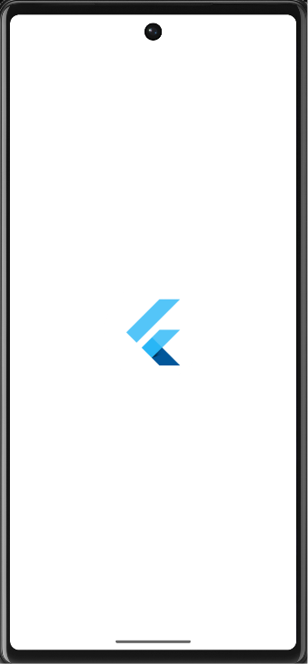
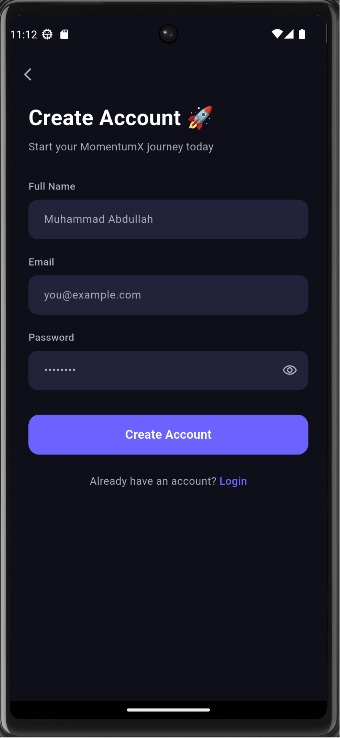
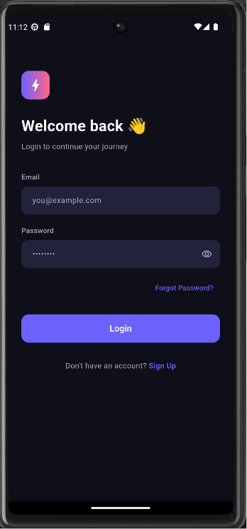
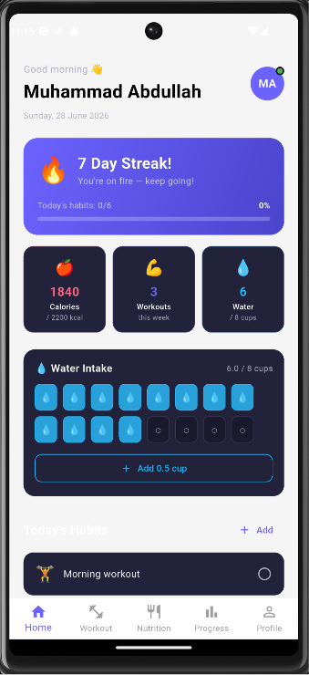
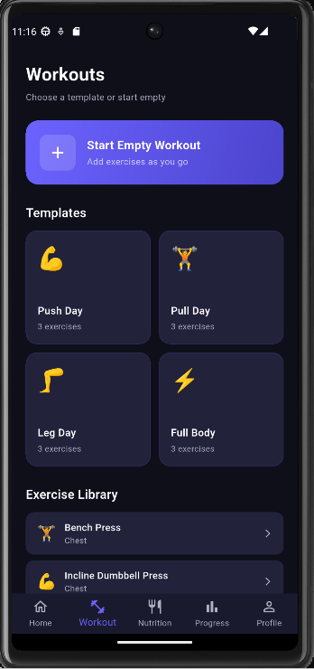
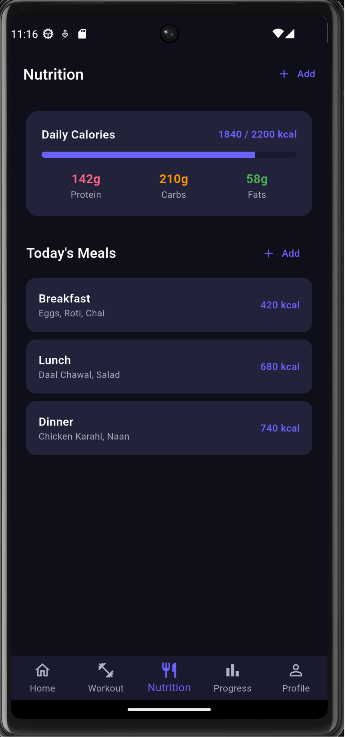
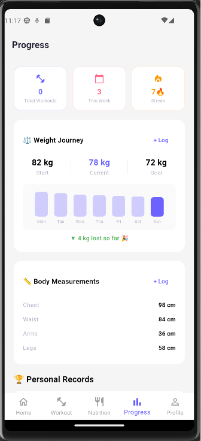
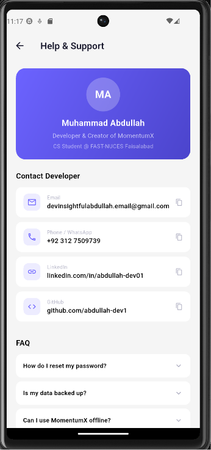

<div align="center">


# MomentumX

### Build. Track. Dominate.

A full-stack fitness and habit tracking Android app built with Flutter and FastAPI.

[](https://flutter.dev)
[](https://fastapi.tiangolo.com)
[](https://python.org)
[](https://postgresql.org)
[](https://dart.dev)

</div>

---

| | | | |
|:---:|:---:|:---:|:---:|
|  |  |  |  |
| Splash | Signup | Login | Home |
|  |  |  |  |
| Workout | Nutrition | Progress | Help & Support |

---

## 📖 Overview

**MomentumX** is a production-quality, full-stack fitness platform designed to help users track workouts, build daily habits, log nutrition, and monitor body progress — all synced securely to a cloud backend via REST API.

Built as a portfolio project to demonstrate real-world full-stack mobile development skills including backend engineering, REST API design, JWT authentication, and state management.

---

## ✨ Features

### 🔐 Authentication
- Secure JWT-based signup and login
- Persistent sessions using SharedPreferences
- Forgot password — generates and emails a new password automatically
- Password hashing with bcrypt

### 🏠 Home Dashboard
- Dynamic greeting based on time of day
- Live streak tracker with progress bar
- Daily stats — calories, workouts, water
- Tap-to-fill water intake tracker
- Habit checklist with streak counter

### 🏋️ Workout Tracker
- 4 built-in templates — Push, Pull, Legs, Full Body
- 17+ exercises across all muscle groups
- Live workout timer
- Log sets, reps, and weight per exercise
- Real-time volume and sets-completed tracker
- Save completed workouts to cloud

### 🔥 Habit Tracking
- Create custom daily habits with emoji
- Tap to complete, swipe to delete
- Animated completion states
- Add unlimited custom habits

### 🍽️ Nutrition Logger
- Log meals with calories
- Daily calorie progress bar
- Macro tracking — Protein, Carbs, Fats
- Swipe to delete meals
- South Asian food friendly (roti, daal, biryani)

### 📈 Progress Analytics
- Weight journey tracker with visual bar chart
- Body measurements logger
- Personal records (PRs) for key lifts
- Weekly workout overview

### 👤 Profile
- Real user data from backend
- Edit profile — name, weight, height, calorie goal
- Theme switcher — Dark / Light / System
- Notification preferences
- Privacy & Security policy
- Help & Support with developer contact
- Logout with session clearing

---

## 🛠️ Tech Stack

| Layer | Technology |
|-------|-----------|
| Mobile Frontend | Flutter (Dart) |
| State Management | Provider |
| Backend | FastAPI (Python) |
| Database | PostgreSQL (Production) / SQLite (Development) |
| Authentication | JWT — python-jose |
| Password Hashing | bcrypt via passlib |
| ORM | SQLAlchemy |
| Email Service | fastapi-mail (Gmail SMTP) |
| Deployment | Railway |

---

## 📂 Project Structure

momentumx/                          # Flutter App

├── lib/

│   ├── core/

│   │   ├── theme.dart              # Dark & Light theme

│   │   └── constants.dart

│   ├── models/

│   │   ├── habit.dart

│   │   ├── exercise.dart

│   │   └── user_stats.dart

│   ├── providers/

│   │   ├── habit_provider.dart     # Habit state

│   │   ├── workout_provider.dart   # Workout state

│   │   ├── user_provider.dart      # User state

│   │   └── theme_provider.dart     # Theme state

│   ├── screens/

│   │   ├── splash/

│   │   ├── onboarding/

│   │   ├── auth/                   # Login, Signup, Forgot Password

│   │   ├── home/                   # Dashboard + widgets

│   │   ├── workout/                # Tracker + Active workout

│   │   ├── nutrition/

│   │   ├── progress/

│   │   └── profile/                # Edit, Help, Settings

│   ├── services/

│   │   └── api_service.dart        # All HTTP calls

│   └── main.dart
momentumx-backend/                  # FastAPI Backend

├── app/

│   ├── core/

│   │   ├── security.py             # JWT + bcrypt

│   │   ├── deps.py                 # Auth dependency

│   │   └── email.py                # Password reset email

│   ├── models/

│   │   ├── user.py                 # SQLAlchemy models

│   │   ├── habit.py

│   │   └── workout.py

│   ├── schemas/

│   │   ├── user.py                 # Pydantic schemas

│   │   ├── habit.py

│   │   └── workout.py

│   ├── routers/

│   │   ├── auth.py                 # Auth endpoints

│   │   ├── habits.py               # Habit CRUD

│   │   └── workouts.py             # Workout CRUD

│   ├── database.py

│   ├── config.py

│   └── main.py

└── requirements.txt

---

## 🚀 Running Locally

### Prerequisites

- [Flutter SDK](https://flutter.dev/docs/get-started/install) (3.0+)
- [Python](https://python.org) (3.11+)
- [Android Studio](https://developer.android.com/studio) with an emulator set up
- Gmail account with App Password enabled

---

### Backend Setup

```bash
# 1. Clone the backend repo
git clone https://github.com/abdullah-dev1/momentumx-backend.git
cd momentumx-backend

# 2. Create virtual environment
python -m venv venv
venv\Scripts\activate        # Windows
source venv/bin/activate     # Mac/Linux

# 3. Install dependencies
pip install -r requirements.txt

# 4. Create .env file
```

Create `.env` in the root of `momentumx-backend`:

```env
DATABASE_URL=sqlite:///./momentumx.db
SECRET_KEY=your-super-secret-key-here
ALGORITHM=HS256
ACCESS_TOKEN_EXPIRE_MINUTES=10080
ENVIRONMENT=development
MAIL_USERNAME=your.gmail@gmail.com
MAIL_PASSWORD=your_16_char_app_password
MAIL_FROM=your.gmail@gmail.com
MAIL_SERVER=smtp.gmail.com
MAIL_PORT=587
```

```bash
# 5. Start the server
uvicorn app.main:app --reload --host 0.0.0.0 --port 8000
```

Backend runs at: `http://127.0.0.1:8000`
Swagger API docs: `http://127.0.0.1:8000/docs`

---

### Flutter App Setup

```bash
# 1. Clone the Flutter repo
git clone https://github.com/abdullah-dev1/momentumx.git
cd momentumx

# 2. Install dependencies
flutter pub get

# 3. Start Android emulator from Android Studio
#    Virtual Device Manager → Play button

# 4. Run the app
flutter run
```

> For Chrome (web): `flutter run -d chrome --web-browser-flag "--disable-web-security"`

---

### Run Order (Every Time)

1. Start Android emulator (Android Studio → Virtual Device Manager → ▶)
2. Terminal 1 → cd momentumx-backend → venv\Scripts\activate → uvicorn app.main:app --reload --host 0.0.0.0 --port 8000
3. Terminal 2 → cd momentumx → flutter run
4. App opens on emulator ✅

---

## 🔌 API Endpoints

### Auth
| Method | Endpoint | Description | Auth Required |
|--------|----------|-------------|---------------|
| POST | `/auth/signup` | Register new user | ❌ |
| POST | `/auth/login` | Login and receive JWT | ❌ |
| GET | `/auth/me` | Get current user profile | ✅ |
| PUT | `/auth/me` | Update user profile | ✅ |
| DELETE | `/auth/me` | Delete account | ✅ |
| POST | `/auth/forgot-password` | Email new password | ❌ |

### Habits
| Method | Endpoint | Description | Auth Required |
|--------|----------|-------------|---------------|
| GET | `/habits/` | Get all habits | ✅ |
| POST | `/habits/` | Create habit | ✅ |
| PUT | `/habits/{id}` | Update / toggle habit | ✅ |
| DELETE | `/habits/{id}` | Delete habit | ✅ |

### Workouts
| Method | Endpoint | Description | Auth Required |
|--------|----------|-------------|---------------|
| GET | `/workouts/` | Get workout history | ✅ |
| POST | `/workouts/` | Save completed workout | ✅ |
| GET | `/workouts/{id}` | Get single workout | ✅ |
| DELETE | `/workouts/{id}` | Delete workout | ✅ |

---

## 🔒 Security

- All passwords hashed with **bcrypt** before storage
- **JWT tokens** expire after 7 days
- `.env` file never committed to version control
- `usesCleartextTraffic` only enabled for local development
- Account deletion removes all associated data permanently

---

## 👨‍💻 Developer

<div align="center">

**Muhammad Abdullah**
CS Student @ FAST-NUCES Faisalabad, Pakistan

[](https://linkedin.com/in/abdullah-dev01)
[](https://github.com/abdullah-dev1)

</div>

---

## 📄 License

This project is open source and available under the [MIT License](LICENSE).

---

<div align="center">
Made with ❤️ in Faisalabad, Pakistan
</div>

